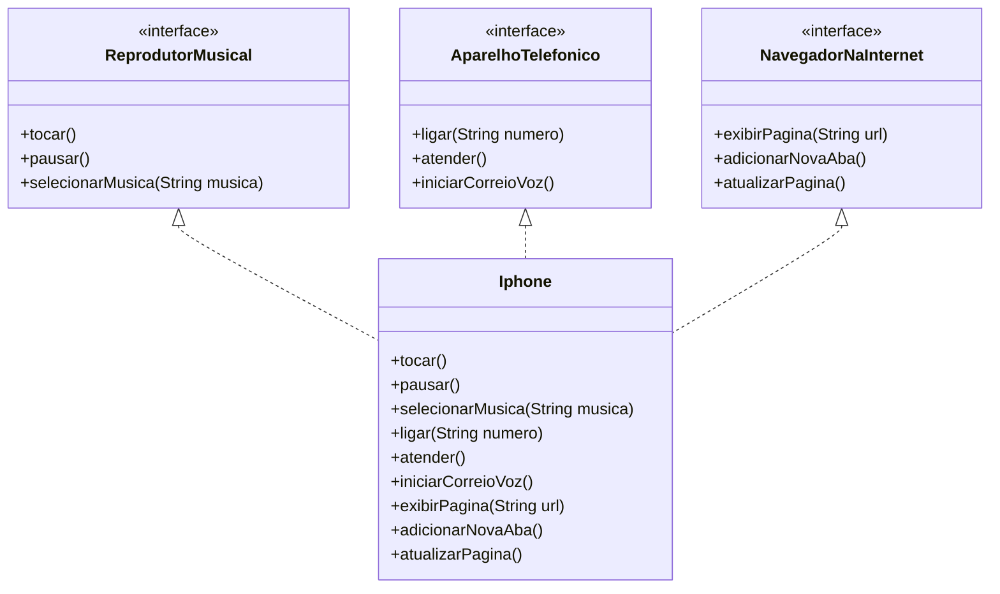

# POO - Desafio

Segue abaixo o diagrama de classe usado para solucionr o desafio.

```mermaid

    classDiagram
    class ReprodutorMusical {
    <<interface>>
    +tocar()
    +pausar()
    +selecionarMusica(String musica)
    }

    class AparelhoTelefonico {
        <<interface>>
        +ligar(String numero)
        +atender()
        +iniciarCorreioVoz()
    }
    
    class NavegadorNaInternet {
        <<interface>>
        +exibirPagina(String url)
        +adicionarNovaAba()
        +atualizarPagina()
    }

    class Iphone {
        +tocar()
        +pausar()
        +selecionarMusica(String musica)
        +ligar(String numero)
        +atender()
        +iniciarCorreioVoz()
        +exibirPagina(String url)
        +adicionarNovaAba()
        +atualizarPagina()
    }

    ReprodutorMusical <|.. Iphone
    AparelhoTelefonico <|.. Iphone
    NavegadorNaInternet <|.. Iphone

```